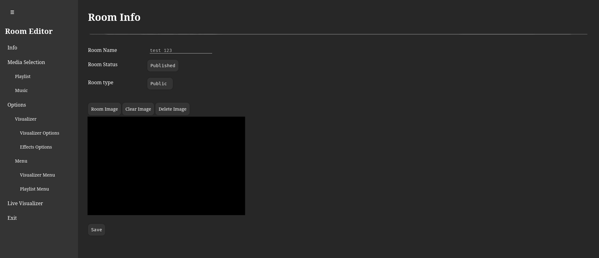
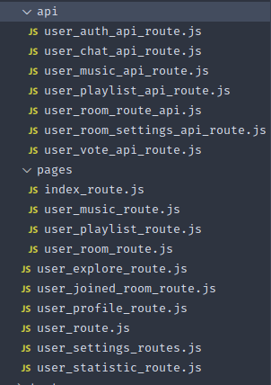
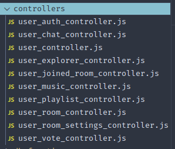

## Room Editor Rehaul

The Room Editor has been redesigned to be more modular and structured.
The new page is divided into multiple sections, each dedicated to a specific type of setting, making the interface more organized and easier to navigate.

On the backend, the conditional logic has also been simplified, since settings are now separated by category.

Music and playlist selection have been separated as well, which improves manageability and reduces complexity in the underlying logic.

Users now have more options to customize the visualizer and menu to better match their style or creative vision. While the visualizer styling system is still a work in progress, the core foundation is already in place.

## Backend Rehaul
### Route Separation

Routes are now split into APIs (non-UI requests) and Pages (UI-specific requests), making the codebase cleaner and responsibilities clearer. Some APIs are still using the legacy implementation and will be migrated once their underlying logic is refactored.

### Controllers

Previously, business logic was embedded directly within the routes. In this version, logic has been moved into dedicated controllers, improving maintainability and readability.

### Automation

New scripts have been added to automate starting, restarting, and stopping all application containers and services.
Currently, operations are applied globally to all components, but support for individual services may be added in the future if needed.

Additionally, a tmux-based log viewer script has been introduced, which makes it easier to debug the application by quickly accessing different logs.

### Tests

Integration tests are now available. While coverage is not yet complete, most music and playlist functionalities are already tested. Unit tests are also being considered for critical functions to prevent logic errors.

### Middlewares

Middleware functions have been introduced to handle common checks such as music and room ownership validation.
This reduces repetitive code and keeps controller functions focused on their main logic.