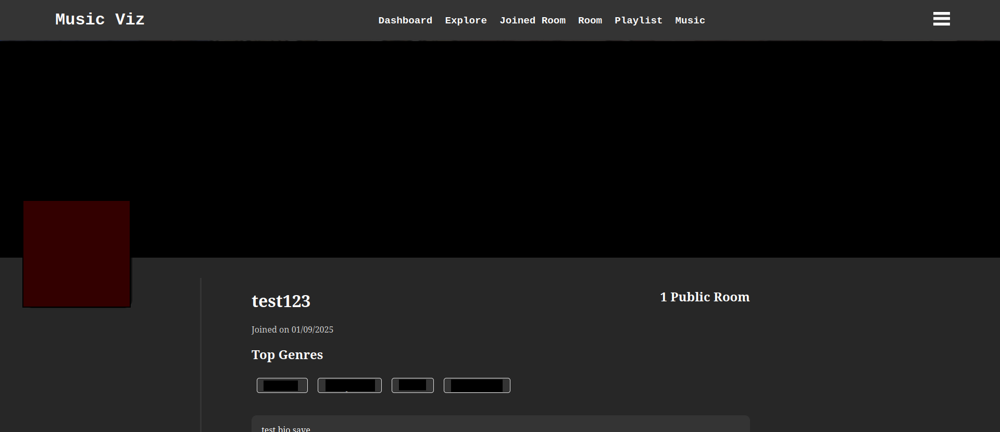
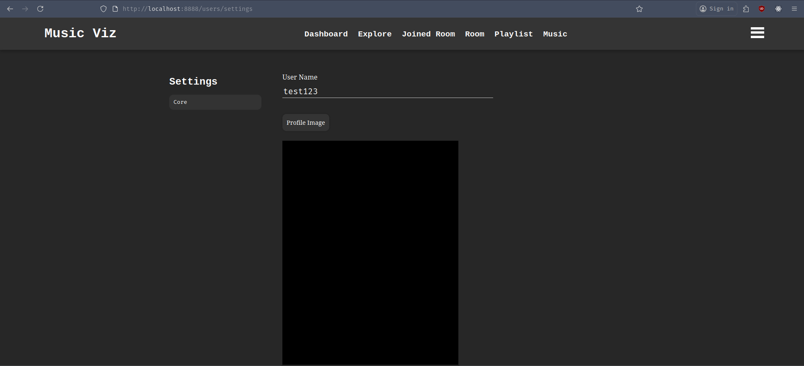
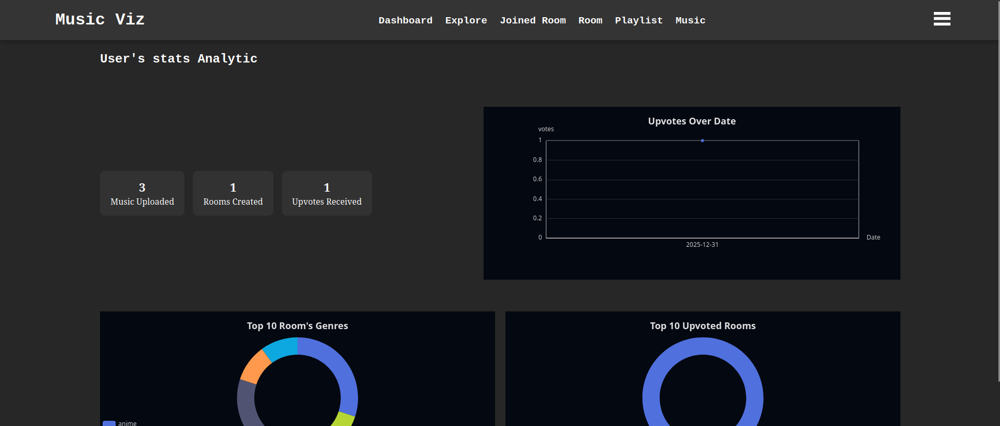
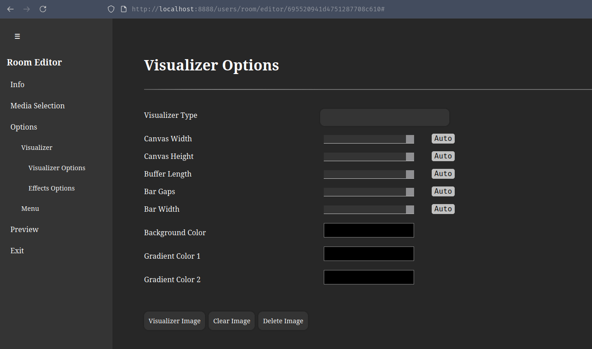
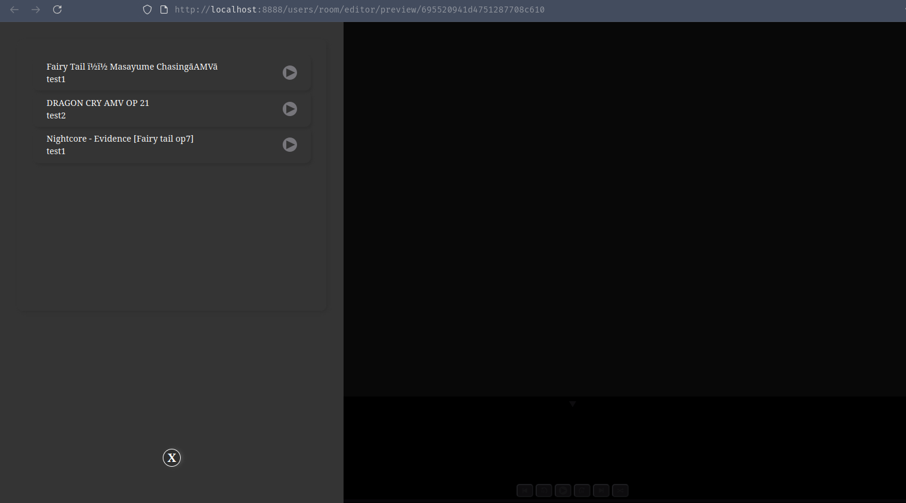

Another version, more feature implementation.

## New Module Implementations

### Profile, Settings, and Stats Pages

Three new user-focused pages were added to improve personalization and insight into user activity.

#### Profile Page

The profile page allows users to view their personal information.
At the moment, profiles are private — public profile viewing for other users will be implemented in a future update.

#### Settings Page

Users can now customize their profile by updating:

- Display name
- Profile image
- Bio

This allows for better personalization and identity within the platform.

#### Stats Page

The stats page provides insights into user activity, including:

- Top rooms
- Most popular genres
- Total upvotes received

All charts are built using Apache ECharts, which turned out to be surprisingly flexible and easy to configure.

## Improvement & Fixes

### Auto Configuration for Room Visualizer

A new Auto option was added to the room editor, allowing automatic configuration of visualization settings.
This reduces manual tweaking and improves the overall user experience.

### Improved Playlist Menu with Customization

The playlist menu has been fully reworked:

- Fixed previous bugs and incomplete behaviors
- Added customization options similar to the visualizer menu
- Improved layout and interaction flow

### Improved Music Splitting Logic & Error Handling

Significant improvements were made to the Python-based music splitting service:

- Fixed an issue where downloaded files from MinIO were missing file extensions, causing Spleeter to fail
- Improved exception handling for better reliability
- Added clearer documentation describing:
    - Expected function parameters
    - Return values
    - Failure scenarios

These changes make future debugging and maintenance much easier.

## What's next
Several features are planned to further improve collaboration, accessibility, and privacy within the platform

### Shareable Rooms via Links
Users will be able to generate shareable links that allow others to join a room instantly, making collaboration faster and more convenient.

### Invite Registered & Unregistered Users
Room owners will be able to invite both existing users and new users who haven’t registered yet, lowering the barrier to entry and improving onboarding.

### Password-Protected Private Rooms
Introduce private rooms secured with passwords, giving users more control over who can access their sessions and content.

These features aim to make rooms more flexible, collaborative, and secure, while maintaining a smooth user experience.