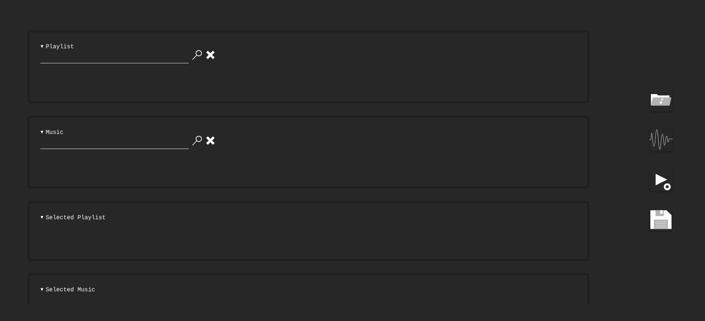

## Intro
Note: The project repository is currently private. It will be made public once the core features of the application are complete.

A full-stack application that lets users create and share immersive music visualization rooms. Users can build custom playlists, design dynamic visualizers tailored to their tracks, and experience them in real-time. Each room offers a social layer with a built-in chat widget for live interactions. To help surface the best creations, users can upvote or downvote rooms based on their visual or musical appeal.

## Tech Explanations
### Frontend
Built with vanilla HTML, CSS, and JavaScript, keeping the frontend lightweight and dependency-free.

### Backend
- NodeJS for backend language
- ExpressJS for backend framework
- MongoDB for storage
- JWT for authentication
- Socket.IO for real time interactions
- MinIO to store images & music
- RabbitMQ to queue tasks to split music to different intruments
- The music are split using spleeter

### Development
- Bash & python scripts for automation
- yt-dlp to download sample music

## Screenshots 

This project is actively evolving, so the UI and APIs may change over time. For a complete history of updates and improvements, check out the [changelogs](../../changelogs/music-viz/).

### Home Page

### Login Page

### Register Page

### Dashboard Page

### Explore Room Page

### Joined Room Page

### Room Info Page

### Entering Room Page

### Entering Room Page - Playing

### Entering Room Page - Playlist

### Room Dashboard Page

### Create Room Page

### Room Editor Page

### Room Editor Page - Preview

### Room Editor Page - Settings

### Room Editor Page - Live Preview

### Playlist Dashboard Page

### Playlist Info Page

### Create Playlist Page

### Create Playlist Page - Search

### Music Dashboard Page

### Upload Music Page

