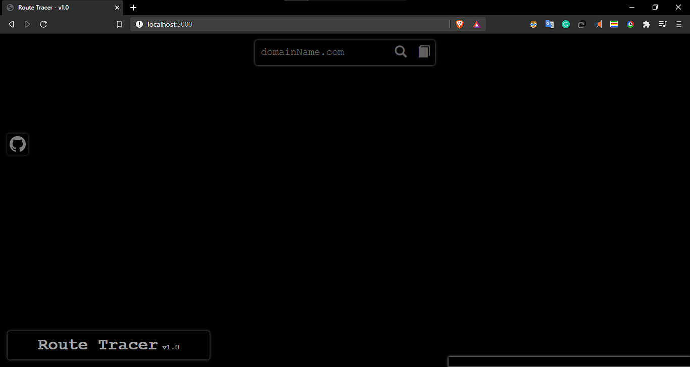
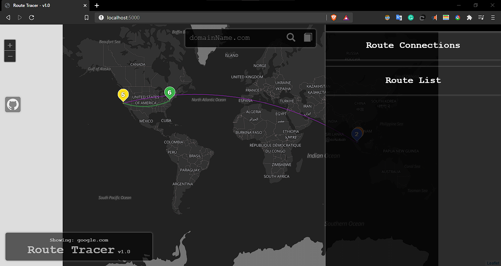
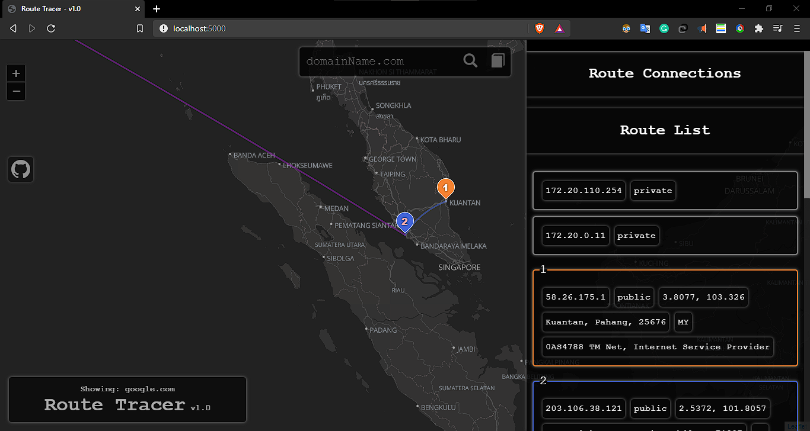
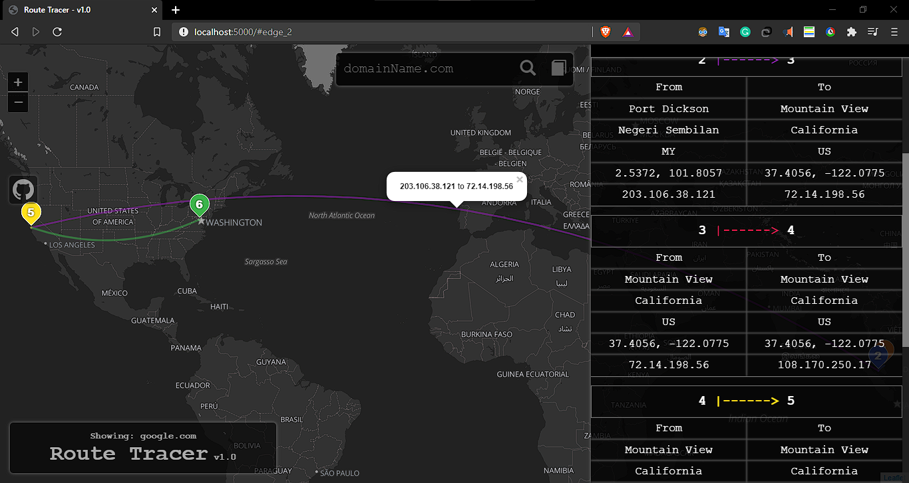
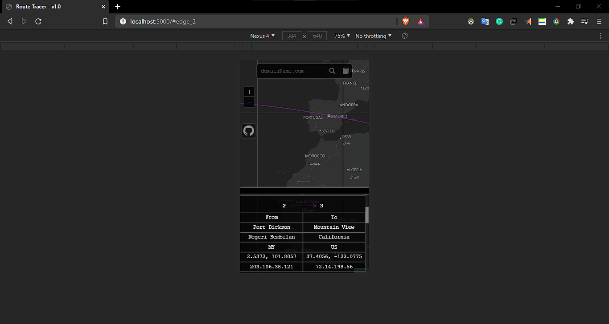

## Intro
Get the information of the node that our packet gone through when reaching to a domain. The website used computer's command tracert (this is in window, if it's in linux the application would use traceroute).

## Features
- Logging
- Old route is saved (more than 10 minute, that route's previous history would be deleted)
- responsive design
- Interactive interface (edges and vertices can be clicked to view their details)

## Screenshots 

### Main Page (desktop)

### Tracing Google

### Selecting a Vertice

### Selecting a Edge

### Mobile View
