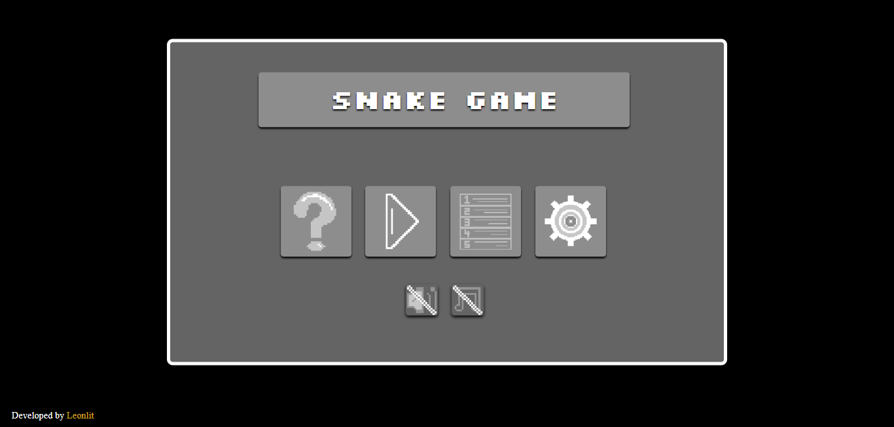
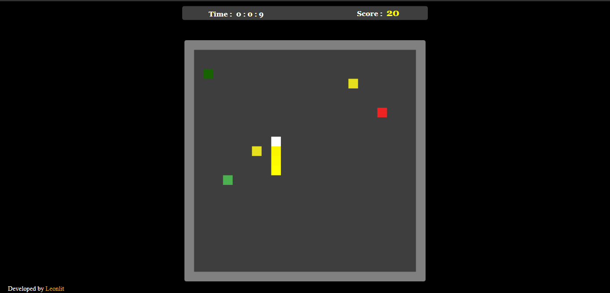

## Intro
A snake game using pure JS, HTML, and CSS. The game is responsive and I've tested it in several devices. The game has a highscore system as well as a settings section where computer's user could change the key for moving the snake and adjusting the audio and music volume. The button animations are done with pixel art created using Piskel.

## Screenshots 

### Main Menu

### In-game imge
