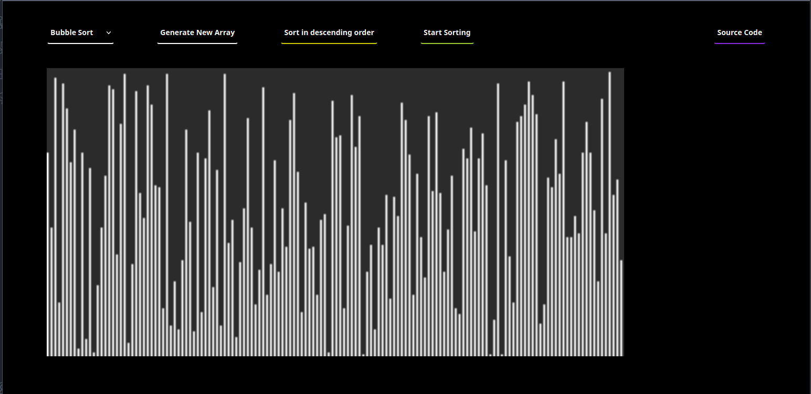
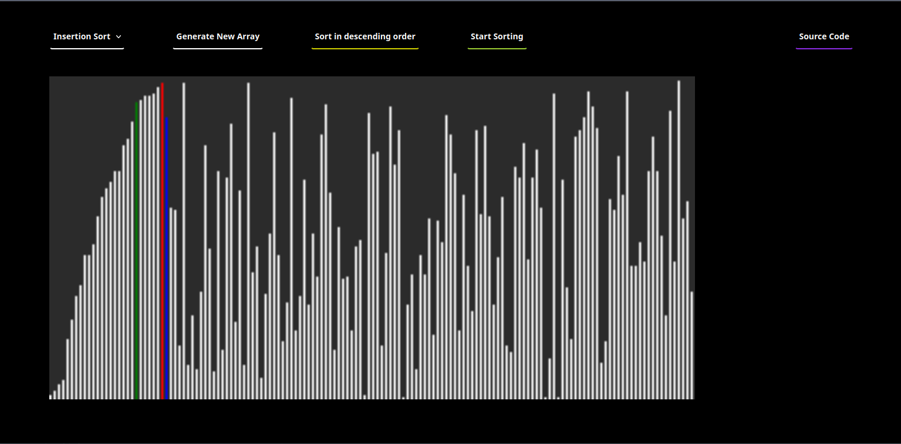
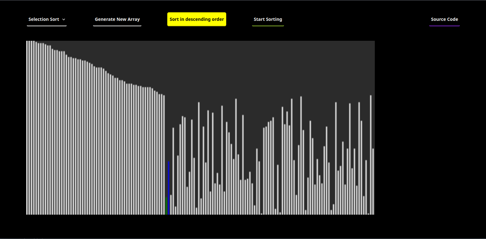
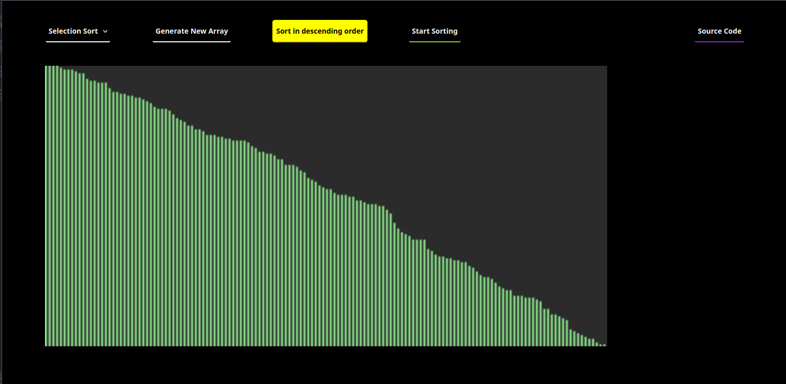

## Intro
A visualization of sorting algorithm using HTML, CSS and Javascript

## Screenshots 

### Generate new Array

### Sorting values

### Sorting values in descending order

### Finished sorting
